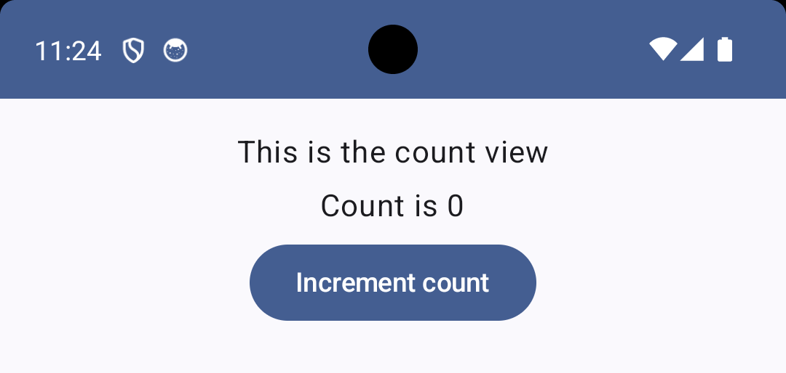

# Demonstration of how to write UI tests for an Activity that has a Composable as its content

This Android application project demonstrates how to write UI tests for an Activity that has a [Composable][3] as its content.

The application itself simply displays a [Button][4] and [Text][5], as follows:

When the Button is tapped, a counter is incremented and the Text displays the current value of the counter.
That's it.

You will find two UI test classes for this application, as follows:

|                        |                                                                                                                             |
|------------------------|-----------------------------------------------------------------------------------------------------------------------------|
| [CountViewTest][1]     | This class tests the Composable in isolation by means of the [ComposeContentTestRule][6] class.                             |
| [CountActivityTest][2] | This class tests the Activity as a whole by means of the [ActivityScenarioRule][7] and [ComposeContentTestRule][6] classes. |

[1]: src/androidTest/java/androidx/test/experiments/app4/CountViewTest.kt
[2]: src/androidTest/java/androidx/test/experiments/app4/CountActivityTest.kt
[3]: https://developer.android.com/reference/kotlin/androidx/compose/runtime/Composable
[4]: https://developer.android.com/reference/kotlin/androidx/compose/material3/package-summary#Button(kotlin.Function0,androidx.compose.ui.Modifier,kotlin.Boolean,androidx.compose.ui.graphics.Shape,androidx.compose.material3.ButtonColors,androidx.compose.material3.ButtonElevation,androidx.compose.foundation.BorderStroke,androidx.compose.foundation.layout.PaddingValues,androidx.compose.foundation.interaction.MutableInteractionSource,kotlin.Function1)
[5]: https://developer.android.com/reference/kotlin/androidx/compose/material/package-summary#Text(androidx.compose.ui.text.AnnotatedString,androidx.compose.ui.Modifier,androidx.compose.ui.graphics.Color,androidx.compose.ui.unit.TextUnit,androidx.compose.ui.text.font.FontStyle,androidx.compose.ui.text.font.FontWeight,androidx.compose.ui.text.font.FontFamily,androidx.compose.ui.unit.TextUnit,androidx.compose.ui.text.style.TextDecoration,androidx.compose.ui.text.style.TextAlign,androidx.compose.ui.unit.TextUnit,androidx.compose.ui.text.style.TextOverflow,kotlin.Boolean,kotlin.Int,kotlin.Int,kotlin.collections.Map,kotlin.Function1,androidx.compose.ui.text.TextStyle)
[6]: https://developer.android.com/reference/kotlin/androidx/compose/ui/test/junit4/ComposeContentTestRule
[7]: https://developer.android.com/reference/androidx/test/ext/junit/rules/ActivityScenarioRule
